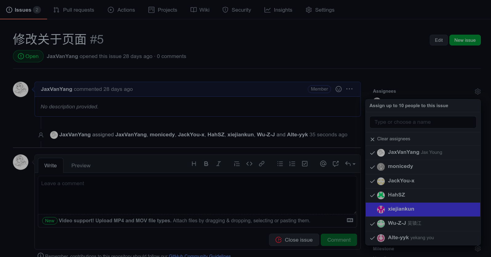

  

> GitHub flow 的核心优势在于其流程带来的自动化可能性，能够做到其它流程无法实现的检查过程，并极大简化开发团队的体力劳动，真正发挥自身的价值。  

本文的基础参考自 GitHub 官方推荐的 [GitHub flow](https://guides.github.com/introduction/flow/)，在阅读之前可以先看看官方文档，以确保更好的阅读体验。  

## 1. 工作的基础
分支是 Git 的核心，也是 GitHub 工作流的基础。只有一个规则：`main` 分支上的所有东西都必须是可靠的。  

所以在本地修改仓库时一定要新建一个分支，取一个有意义的分支名，以便在后面的协作环节让其他人能更快地知道你在尝试做什么。  
<br>

## 2. 创建一个讨论
如果你在自己的分支中碰到一个问题，或者是希望能有其他人一起来完成这个分支的开发，那么你就可以将这个分支推送到 GitHub 上：  
```bash
# 一定要取一个有意义的分支名，这样可以让别人知道这个分支有什么用
git push origin my_branch:my_branch
```

然后在 GitHub 上创建一个 `PR`，也就是 `Pull requests`，直译过来是“拉取请求”，然后就会 GitHub 就会比较这两个分支，所有人都可以看到它们的不同，比起自己一个人在分支上埋头苦干，PR 会释放一个信号告诉大家我这个分支需要你们来看一看以引起讨论。  

  

除了 PR 还有一种方式可以在 GitHub 上进行讨论，那就是 `Issues`，翻译过来就是“议题”，常用于 BUG 的提交，也可以在这里进行一般的讨论。Issues 也有两种状态，`Open` 和 `Closed`，当议题里提到的任务完成或者 BUG 修复后就可以将议题关闭，如果以后又碰到相同的问题还可以重新打开。  

GitHub 上所有可以输入评论的地方都可以使用 `@`，如果你想提醒某个人，你就可以在相应的地方 `@` TA。  

另外也可以使用 GitHub 的任务分配功能，还可以设定具体的完成时间确保项目顺利进行。  

  
<br>

## 3. 合并到主分支
当分支上的内容都经过测试后就可以将其合并到主分支了，然后删除已经合并的分支。  
<br>

## 后记
我知道大家都很忙，很难碰到大家都有空的时间，比起社交软件上即时的聊天来说，可能 GitHub 上的讨论更适合我们，只需要在 **有时间的时候上** GitHub 看看有没有能做贡献的就行，这不会花费太多时间！  

所以我希望大家将和协作有关的讨论都搬到 GitHub 上，毕竟很多开源软件用的都是这种方法，我相信它一定可以提升我们的协作能力，也能提高我们的开发效率。  
